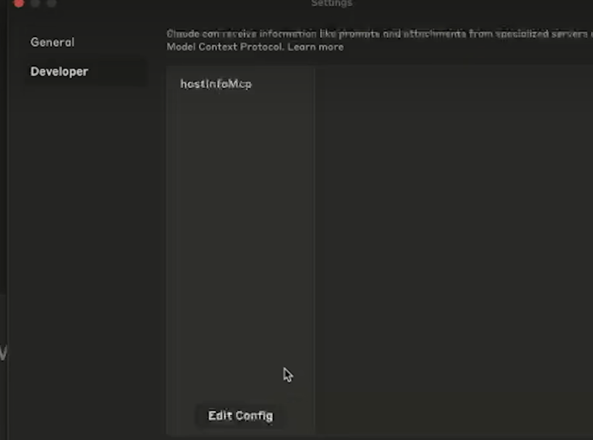

要添加你自己编写的 **MCP (Model Context Protocol)** 服务，不同的工具（Cline, Copilot, ChatGPT, Gemini）有不同的配置方式。

由于 MCP 是一个较新的标准，目前 **Cline** 和 **Cursor** 的支持最成熟，而网页版（ChatGPT/Gemini）通常需要通过特定的“开发者模式”或“桥接工具”。

以下是详细的操作指南：

---

### 1. Cline (VS Code 扩展) —— **最推荐**

Cline 对 MCP 的支持非常友好。

- **操作步骤** ：

1. 点击 Cline 侧边栏底部的 **“MCP Settings”** （小齿轮图标）。
2. 它会打开一个名为 `cline_mcp_settings.json` 的配置文件。
3. 在 `mcpServers` 下添加你的配置。例如，如果你是用 Node.js 写的本地脚本：
   **JSON**

   ```
   {
     "mcpServers": {
       "my-custom-server": {
         "command": "node",
         "args": ["/path/to/your/server/index.js"],
         "env": {
           "MY_API_KEY": "your_key_here"
         }
       }
     }
   }
   ```

4. 保存后，Cline 会自动尝试启动该服务，成功后你会在面板看到绿色的激活状态。

---

### 2. GitHub Copilot (VS Code)

Copilot 最近开始在 Insider 版本或特定 Beta 版中测试 MCP 支持。

- **操作步骤** ：

1. 打开 VS Code 的命令面板（`Ctrl+Shift+P`）。
2. 输入并选择 **“MCP: Add Server”** 。
3. 选择 **“Global”** （全局）或 **“Workspace”** （仅当前项目）。
4. 它会创建一个 `.vscode/mcp.json` 文件。
5. 填入与上面类似的 JSON 配置，然后点击文件顶部的 **“Start”** 按钮。

---

### 3. ChatGPT 网页版

ChatGPT 网页版**不能直接连接**你电脑上的本地 `stdio` 服务，因为它运行在云端。

- **方法 A（官方开发者模式）** ：
- 你需要将你的 MCP 服务部署为一个 **HTTPS 远程服务** （例如部署在 Cloud Run 或 Vercel 上）。
- 进入 **Settings -> Connectors -> Advanced -> Developer mode** (需 Plus/Enterprise 账户)。
- 点击 **Create** ，输入你远程 MCP 服务的 URL。
- **方法 B（Docker 桥接）** ：
- 使用 Docker 推出的 **MCP Toolkit** ，它可以作为一个中转站，把本地服务暴露给 ChatGPT 网页版。

---

### 4. Gemini (网页版 vs. CLI)

- **Gemini 网页版 (gemini.google.com)** ：目前**不支持**直接添加自定义本地 MCP。
- **Gemini CLI (geminicli)** ：
- 在你的家目录下找到或创建 `.gemini/settings.json`。
- 添加配置：
  **JSON**

  ```
  {
    "mcpServers": {
      "my-server": { "command": "npx", "args": ["your-mcp-package"] }
    }
  }
  ```

- **Firebase Studio (Google 的 IDE)** ：在 `.idx/mcp.json` 中配置。

---

### 总结建议

| **如果你想...**              | **推荐工具**                                                      |
| ---------------------------- | ----------------------------------------------------------------- |
| **在写代码时用自己写的 MCP** | **Cline**或 **Cursor** 。直接改配置文件就能用，门槛最低。         |
| **在终端自动化任务**         | **Gemini CLI** 。                                                 |
| **在网页对话里用**           | 必须将 MCP 部署到公网，或者等待官方后续推出更简单的本地桥接工具。 |

**你是用什么语言编写的 MCP 服务（Python 还是 Node.js）？如果你有具体的报错信息，我可以帮你排查配置是否正确。**

或者使用 claude desktop




